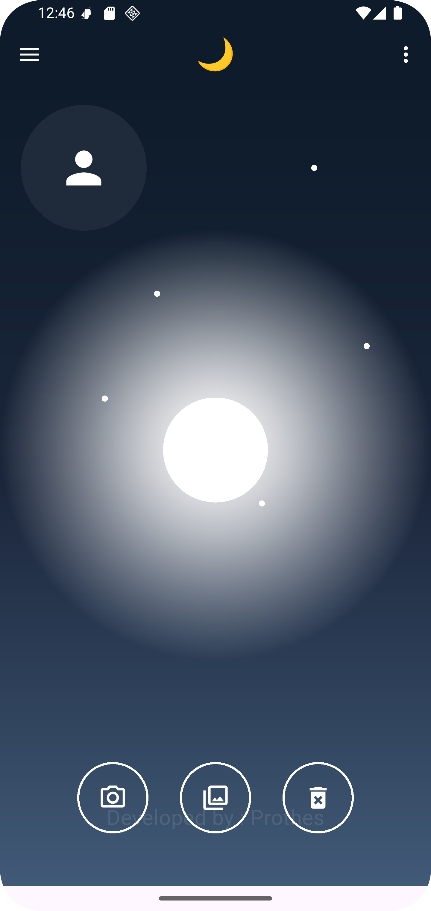

# 📸 User Profile Upload with Hive

A **Flutter** application that allows users to upload their profile image from camera or gallery and stores it locally using **Hive** database.

---

## 🚀 Getting Started
This project is a starting point for a Flutter application. If you are new to Flutter, these resources will help:
- [Flutter Docs](https://flutter.dev/docs)
- [Flutter Cookbook](https://docs.flutter.dev/cookbook)

---

## 📦 Prerequisites

Make sure you have the following installed:

- [Flutter SDK](https://flutter.dev/docs/get-started/install)
- [Dart SDK](https://dart.dev/get-dart)
- [Hive package](https://pub.dev/packages/hive)

---

## 🧰 Uses Packages
- For Images : 
```flutter
  image_picker: ^1.2.0
  image_cropper: ^9.1.0
  flutter_image_compress: ^2.4.0
  path: ^1.9.0
```

- image_picker → ব্যবহারকারী ক্যামেরা বা গ্যালারি থেকে ছবি আপলোড করতে।
- image_cropper → আপলোড করা ছবিকে ক্রপ করার জন্য।
- flutter_image_compress → ছবির সাইজ কমানোর জন্য।
- path → ফাইলের লোকেশন বা ডিরেক্টরি হ্যান্ডেল করার জন্য

- For Hive & Provider
```flutter
  provider: ^6.1.5
  hive: ^2.2.3
  hive_flutter: ^1.1.0
  path_provider: ^2.1.5
```

- provider → স্টেট ম্যানেজমেন্টের জন্য।
- hive → লোকাল ডাটাবেস সংরক্ষণের জন্য।
- hive_flutter → Flutter এর সাথে Hive সহজে ব্যবহার করার জন্য।
- path_provider → ডিভাইসের লোকাল ডিরেক্টরি পেতে।


## Main Code Some Explain :
```dart
    // ProfileImageProvider থেকে প্রফাইল ইমেজ সংরক্ষণ ও রিট্রিভ করার জন্য ব্যবহার করা হবে
    File? profileImage;
    
    // ImagePicker ইনস্ট্যান্স তৈরি
    final ImagePicker _imagePicker = ImagePicker();
    
    // ইমেজ নির্বাচন করার ফাংশন
    Future<void> pickImage(ImageSource source) async {
      try {
        // Provider থেকে প্রফাইল ইমেজের ডেটা নিয়ন্ত্রণের জন্য ইনস্ট্যান্স
        final imageProvider = Provider.of<ProfileImageProvider>(context, listen: false);
    
        // ইউজারের কাছ থেকে ক্যামেরা বা গ্যালারি থেকে ইমেজ নির্বাচন করা
        final originalImage = await _imagePicker.pickImage(source: source);
        if (originalImage == null) return; // যদি ইমেজ না নেওয়া হয় তাহলে ফাংশন শেষ
    
        // নির্বাচিত ইমেজের সাইজ প্রিন্ট করা (কেবল ডিবাগ মোডে)
        final originalImageSize = await File(originalImage.path).length();
        if (kDebugMode) {
          print("Original Image Size : ${originalImageSize / 1024} KB");
        }
    
        // ইমেজ ক্রপ করা (বর্গক্ষেত্র)
        final cropImage = await ImageCropper().cropImage(
          sourcePath: originalImage.path,
          compressFormat: ImageCompressFormat.jpg,
          aspectRatio: CropAspectRatio(ratioX: 1, ratioY: 1),
          uiSettings: [
            AndroidUiSettings(
              toolbarTitle: "Crop Image",
              toolbarColor: Colors.blue,
              toolbarWidgetColor: Colors.white,
              lockAspectRatio: true,
              hideBottomControls: false,
              initAspectRatio: CropAspectRatioPreset.square,
            ),
            IOSUiSettings(
              title: "Crop Image",
              aspectRatioLockEnabled: true,
              hidesNavigationBar: false,
              aspectRatioPickerButtonHidden: false,
              minimumAspectRatio: 1.0,
            )
          ],
        );
        if (cropImage == null) return; // যদি ক্রপ করা না হয়
    
        // ক্রপ করা ইমেজের সাইজ প্রিন্ট করা
        final cropImageSize = await File(cropImage.path).length();
        if (kDebugMode) {
          print("Crop Image Size : ${cropImageSize / 1024} KB");
        }
    
        // ---------------- Image Compression শুরু ----------------
        final tempDir = await getTemporaryDirectory();
        final tempPath = path.join(
          tempDir.path,
          "compressed_${DateTime.now().millisecondsSinceEpoch}.jpg",
        );
    
        // প্রথম ধাপের কম্প্রেশন (70% quality)
        final firstCompressed = await FlutterImageCompress.compressAndGetFile(
          cropImage.path,
          tempPath,
          quality: 70,
          minHeight: 512,
          minWidth: 512,
        );
        if (firstCompressed == null) return;
    
        final firstCompressedImgSize = await firstCompressed.length();
        if (kDebugMode) {
          print("First Compressed Size : ${firstCompressedImgSize / 1024} KB");
        }
    
        // যদি প্রথম কম্প্রেসড ইমেজ 300 KB এর বেশি হয়
        if (firstCompressedImgSize > (300 * 1024)) {
          final againFinalCompressed = await FlutterImageCompress.compressAndGetFile(
            cropImage.path,
            tempPath,
            quality: 50,
            minHeight: 512,
            minWidth: 512,
          );
    
          if (againFinalCompressed != null) {
            // ফাইনাল কম্প্রেসড ইমেজের সাইজ প্রিন্ট
            final finalCompressedSize = await againFinalCompressed.length();
            if (kDebugMode) {
              print("Final Compressed Image is : ${finalCompressedSize / 1024} KB");
            }
    
            // ইমেজকে স্থায়ী লোকেশন এ সেভ করা
            final permanentDirectory = await getApplicationDocumentsDirectory();
            final permanentPath =
                "${permanentDirectory.path}/profile_${DateTime.now().millisecondsSinceEpoch}.jpg";
            await againFinalCompressed.saveTo(permanentPath);
            final permanentImage = File(permanentPath);
    
            profileImage = permanentImage; // UI আপডেটের জন্য সেট করা
            setState(() {});
            await imageProvider.saveProfileImage(permanentImage); // Hive এ সেভ করা
          }
        } else {
          // যদি প্রথম কম্প্রেসড ইমেজ 300 KB এর কম হয়, সরাসরি সেটি সেভ করা
          final permanentDirectory = await getApplicationDocumentsDirectory();
          final permanentPath =
              "${permanentDirectory.path}/profile_${DateTime.now().millisecondsSinceEpoch}.jpg";
          await firstCompressed.saveTo(permanentPath);
          final permanentImage = File(permanentPath);
    
          profileImage = permanentImage;
          setState(() {});
          await imageProvider.saveProfileImage(permanentImage);
        }
      } catch (e) {
        debugPrint("Something Error : $e"); // কোনো এরর হলে প্রিন্ট
      }
    }
```


## 🛠️ Installation

1. Clone the repository:
 ```bash
   git clone https://github.com/prothesbarai/user_profile_upload_img_with_hive.git
 ```


# 🚀 Install APK File Link:
[Download APK File > Click raw](https://github.com/prothesbarai/collect/blob/main/Build%20APK%20File/user_profile_with_hive.apk)


## 🚀 Screenshot Demo
<p float="left">
  
  
</p>


## Author
[Prothes Barai](https://github.com/prothesbarai/)